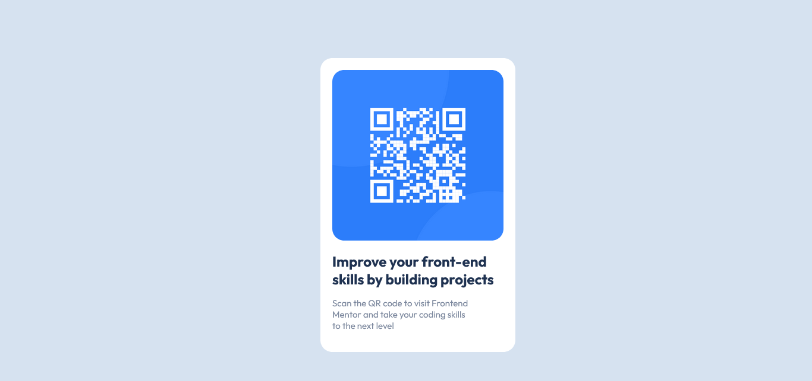

# Frontend Mentor - QR code component solution

This is a solution to the [QR code component challenge on Frontend Mentor](https://www.frontendmentor.io/challenges/qr-code-component-iux_sIO_H). Frontend Mentor challenges help you improve your coding skills by building realistic projects.

## Table of contents

- [Overview](#overview)
  - [Screenshot](#screenshot)
  - [Links](#links)
- [My process](#my-process)
  - [Built with](#built-with)
  - [What I learned](#what-i-learned)
  - [Continued development](#continued-development)
  - [Useful resources](#useful-resources)
- [Author](#voqh)

## Overview

QR Code component project. A web page with a QR Code for the frontend mentor website.

### Screenshot



### Links

- Live Site URL: [https://Voqh.github.io/]

## My process

### Built with

- Semantic HTML5 markup
- CSS custom properties

### What I learned

How to add google font to an HTML document using a <link> tag and adding the font to an element using css font-family property.
How to place a <div> element in the middle of a page using css position element with value fixed.
Giving top and left properties value of 50% each and adjusting margin-top and margin-left properties with
with values of half height of the element and half the width of the element respectively.

```css
.main{
    background-color:hsl(0, 0%, 100%);
    position: fixed;
    top: 50%;
    left: 50%;
    margin-top:-223.67px;
    margin-left: -144px;
    padding: 20px;
    border-radius: 10px;
```

### Continued development

CSS position property

### Useful resources

- [https://medium.com/@svinkle/publish-and-share-your-own-website-for-free-with-github-2eff049a1cb5]- This article helped me learn how to Configure my repository to publish the code to a web address on GITHUB.

## Author

- Frontend Mentor - [@voqh](https://www.frontendmentor.io/profile/voqh)
- Twitter - [@kelvo_ndegwa](https://www.twitter.com/voqh)
